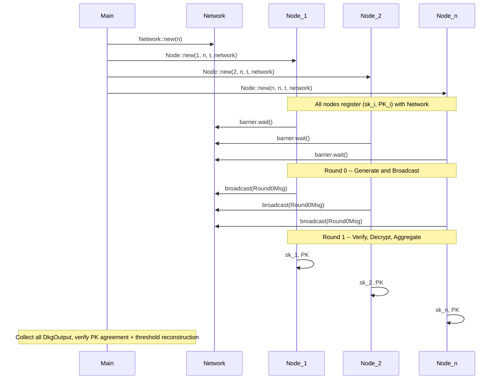

# Golden DKG Rust Prototype

## Project Layout

```
/wrk/tmt/goldenkeysharing/
├── Cargo.toml
├── README.md
├── TODO_ZK_PROOFS.md          # Deferred: Bulletproofs eVRF circuit
├── src/
│   ├── lib.rs                 # Re-exports all modules
│   ├── main.rs                # Test harness: spawn n nodes, verify results
│   ├── types.rs               # NodeId, Round0Msg, Ciphertext, DkgOutput
│   ├── network.rs             # Broadcast channel + peer discovery table
│   ├── node.rs                # Node struct, async run() lifecycle
│   ├── shamir.rs              # Polynomial eval, share generation, Lagrange interpolation
│   ├── vss.rs                 # Feldman VSS commitments (g^{a_i} for polynomial coefficients)
│   ├── evrf.rs                # Simplified eVRF: DH shared secret -> pad derivation (no ZK proof)
│   └── protocol.rs            # Round0 message construction + Round1 verification/decryption
```

## Dependencies (Cargo.toml)

- `ark-bls12-381 = "0.5"` -- BLS12-381 curve (G1, Fr, Fq)
- `ark-ec = "0.5"` -- elliptic curve traits, hash-to-curve (WB map)
- `ark-ff = "0.5"` -- field arithmetic
- `ark-std = "0.5"` -- UniformRand, test utilities
- `ark-serialize = "0.5"` -- serialization for curve elements
- `tokio = { version = "1", features = ["full"] }` -- async runtime, channels, barriers
- `sha2 = "0.10"` -- hashing for hash-to-curve domain separation
- `rand = "0.8"` -- randomness
- `tracing` + `tracing-subscriber` -- structured logging

## Architecture




## Cryptographic Design

**Curve:** BLS12-381 G1 for all group operations (prototype simplification -- paper uses two groups G_in/G_out).

**Prototype simplification for x-coordinate extraction:** The paper derives pads from Fp (base field, 381 bits). We reduce `x mod r` into the scalar field Fr (255 bits). This is lossy but functional for a prototype. Noted in TODO.

**Shamir Secret Sharing (shamir.rs):**

- `Polynomial`: `Vec<Fr>` -- random polynomial of degree `t-1` with `f(0) = secret`
- `share(i) -> Fr`: evaluate polynomial at index `i`
- `lagrange_interpolate_at_zero(shares: &[(u32, Fr)]) -> Fr`: reconstruct secret

**Feldman VSS (vss.rs):**

- Commitment: `Vec<G1Affine>` where `A_k = g^{a_k}` for each coefficient `a_k`
- Verify share: check `g^{f(j)} == Π A_k^{j^k}` for all `k`

**Simplified eVRF (evrf.rs):**

- Derive DH shared secret: `S = PK_j * sk_i`
- Extract x-coordinate: `k = int(S.x) mod r`
- Hash to curve: `T1 = H_1(msg)^k`, `T2 = H_2(msg)^k` using arkworks `MapToCurveBasedHasher` with domain separation
- Derive pad: `r = β * int(T1.x mod r) + int(T2.x mod r)`
- Output: `(r, R = g^r)`
- **ZK proof: SKIPPED** -- placeholder returns `()`, verification is a no-op. Documented in TODO_ZK_PROOFS.md.

## Network Layer (network.rs)

- `Network` holds a `tokio::sync::broadcast::Sender<Round0Msg>` and a shared `Arc<RwLock<HashMap<NodeId, G1Affine>>>` peer table
- Registration: node writes `(id, PK_i)` into the peer table, gets a `broadcast::Receiver`
- `tokio::sync::Barrier(n)` ensures all nodes have registered before Round 0 starts
- Broadcasting: `sender.send(msg)` delivers to all subscribers
- Each node filters out its own messages by `msg.from != self.id`

## Message Types (types.rs)

- `Round0Msg { from: NodeId, random_msg: [u8; 32], vss_commitment: Vec<G1Affine>, ciphertexts: HashMap<NodeId, Ciphertext> }`
- `Ciphertext { r_commitment: G1Affine, encrypted_share: Fr }`
- `DkgOutput { public_key: G1Affine, public_key_shares: Vec<G1Affine>, secret_share: Fr }`

## Protocol Logic (protocol.rs)

**round0(node, peers) -> Round0Msg:**

1. Sample `ω_i` uniformly at random
2. Build polynomial `f_i` of degree `t-1` with `f_i(0) = ω_i`
3. Compute Feldman VSS commitment `C̄_i`
4. For each peer `j`: derive `r_{i,j}` via simplified eVRF, compute `z_{i,j} = r_{i,j} + f_i(j)`
5. Return broadcast message

**round1(node, peers, received_msgs) -> DkgOutput:**

1. For each received `msg_j`, for each peer `k`:
  - Check VSS consistency: `g^{z_{j,k}} == R_{j,k} * X̄_{j,k}` where `X̄_{j,k} = Π A_{j,l}^{k^l}`
  - Skip eVRF proof verification (TODO)
2. Decrypt own shares: re-derive `r_{j,i}` via eVRF, compute `x̄_{j,i} = z_{j,i} - r_{j,i}`
3. Aggregate: `sk_i = Σ_j x̄_{j,i}` (including own share `x̄_{i,i}`)
4. Derive `PK = Π_j A_{j,0}` and public key shares `PK_k = Π_j X̄_{j,k}`

## Test Harness (main.rs)

1. Spawn `n = 5` nodes with threshold `t = 3`
2. Each node runs the full protocol as a tokio task
3. Collect all `DkgOutput` values
4. **Assert**: all nodes agree on the same `PK`
5. **Assert**: any `t` nodes' shares reconstruct `sk` via Lagrange interpolation, and `g^sk == PK`
6. Print summary with timing

## BLS Threshold Signatures

Stubbed as a module comment / empty struct. The user will share a separate paper to define the interface. The `DkgOutput` is structured to feed directly into threshold BLS: each node holds `sk_i` (its Shamir share of the signing key) and the group `PK`.