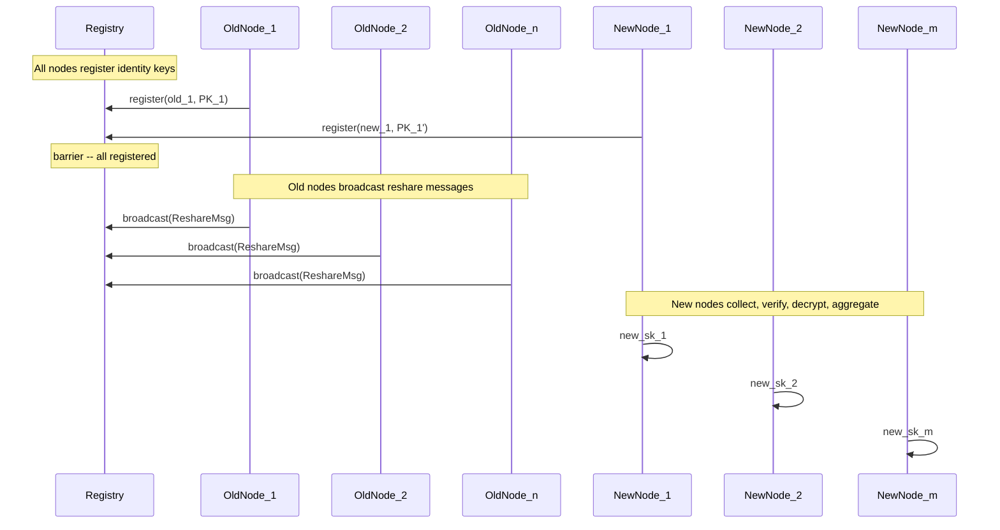

# Resharing (Membership Change)

## Concept

Resharing transfers a threshold secret from OLD group `(n_old, t_old)` to NEW group `(n_new, t_new)` while keeping `sk` and `PK` unchanged. The groups may overlap, be completely disjoint, or have any combination.

**Standard technique (adapted to Golden's eVRF encryption):**

1. Each OLD member `i` (holding share `sk_i`) acts as a dealer:
  - Creates polynomial `g_i` of degree `t_new - 1` with `g_i(0) = sk_i`
  - Encrypts `g_i(j)` for each NEW member `j` using Golden's eVRF pad
  - Broadcasts VSS commitment + encrypted shares
2. Each NEW member `j` collects at least `t_old` valid broadcasts:
  - Decrypts sub-shares `s_{i,j} = g_i(j)` from each old member `i`
  - Computes Lagrange coefficients `L_i(0)` for the old members' indices
  - Aggregates: `new_sk_j = sum_{i in S} s_{i,j} * L_i(0)`
3. Result: `new_sk_j` are degree `(t_new - 1)` Shamir shares of the same `sk`.

**Why it works:** `F(x) = sum_i g_i(x) * L_i(0)` is degree `t_new - 1`, and `F(0) = sum_i sk_i * L_i(0) = sk`.

## Architecture




## New Files and Types

### `src/types.rs` -- Add `ReshareMsg`

```rust
#[derive(Clone, Debug)]
pub struct ReshareMsg {
    pub from: NodeId,          // Old node's unique ID
    pub random_msg: [u8; 32],
    pub vss_commitment: Vec<G1Affine>,  // g^{a_k} for polynomial g_i with g_i(0) = sk_i
    pub ciphertexts: HashMap<NodeId, Ciphertext>,  // Encrypted for each NEW node
}
```

Add Borsh serialization (same pattern as `Round0Msg`).

### `src/reshare.rs` -- New module with resharing protocol

`**ReshareConfig`:**

```rust
pub struct ReshareConfig {
    pub old_threshold: u32,
    pub new_n: u32,
    pub new_threshold: u32,
}
```

`**reshare_deal**` (old node's role):

- Input: old node's share `sk_i`, old node's identity key, new members' PKs, `t_new`, beta
- Create polynomial `g_i` of degree `t_new - 1` with `g_i(0) = sk_i`
- Encrypt `g_i(j)` for each new member using eVRF pads
- Return `ReshareMsg`

`**reshare_receive**` (new node's role):

- Input: new node's identity key, new node's index in new group, all received `ReshareMsg`s, old members' PKs and indices, `t_old`, beta, original PK
- Verify each old member's ciphertexts against VSS commitments
- Verify `g^{vss_commitment[0]}` matches the old member's known public key share (optional extra check)
- Decrypt sub-shares from each old member
- Compute Lagrange coefficients for old member indices
- Aggregate: `new_sk_j = sum s_{i,j} * L_i(0)`
- Derive new public key shares from VSS commitments
- Return `DkgOutput` with same PK, new shares

### `src/reshare_network.rs` -- Reshare-specific network

A `ReshareNetwork` that handles the two-group topology:

- Old nodes and new nodes both register
- Uses `broadcast::Sender<ReshareMsg>` (not `Round0Msg`)
- Barrier waits for `n_old + n_new` (or a configurable count if groups overlap)
- Old nodes broadcast, new nodes listen

### `src/reshare_node.rs` -- Old and new node roles

`**OldReshareNode`:**

- Holds: old identity key, old share, old public key shares
- `async fn run(self)` -- register, wait, deal, broadcast

`**NewReshareNode`:**

- Holds: new identity key, new index in new group
- `async fn run(self) -> DkgOutput` -- register, wait, collect `n_old` messages, verify + aggregate

### `src/lib.rs` -- Add module declarations

```rust
pub mod reshare;
pub mod reshare_network;
pub mod reshare_node;
```

### `src/main.rs` -- Add resharing test

After DKG + refresh, add a third phase:

1. Initial DKG: `(n=5, t=3)` -> nodes {1,2,3,4,5}
2. Refresh: same group, rotated shares
3. **Reshare to (n=4, t=2)**: drop node 5, reduce threshold
  - Old group: nodes {1,2,3,4,5} with t_old=3
  - New group: nodes {1,2,3,4} with t_new=2
4. Verify:
  - PK unchanged
  - New shares reconstruct same sk
  - All C(4,2)=6 combinations of new shares work
  - Fewer than t_new=2 shares fail
5. **Reshare to (n=7, t=4)**: add 3 new nodes, raise threshold
  - Old group: nodes {1,2,3,4} with t_old=2
  - New group: nodes {1,2,3,4,5,6,7} with t_new=4
6. Verify:
  - PK unchanged
  - All C(7,4)=35 combinations work

## Key Design Decisions

- Old and new node ID spaces are independent (a node can have old_id=3 and new_id=3 -- they might be the same physical node or different)
- The `ReshareMsg` is separate from `Round0Msg` because the semantics differ (dealer shares their existing share, not a random omega)
- The `reshare_receive` function needs the old members' PUBLIC KEY SHARES `g^{sk_i}` to optionally verify that each dealer's `vss_commitment[0] == g^{sk_i}` (prevents a malicious old member from dealing a different secret)
- The Lagrange coefficients for old members are computed using their OLD indices (1-indexed in the old group)
