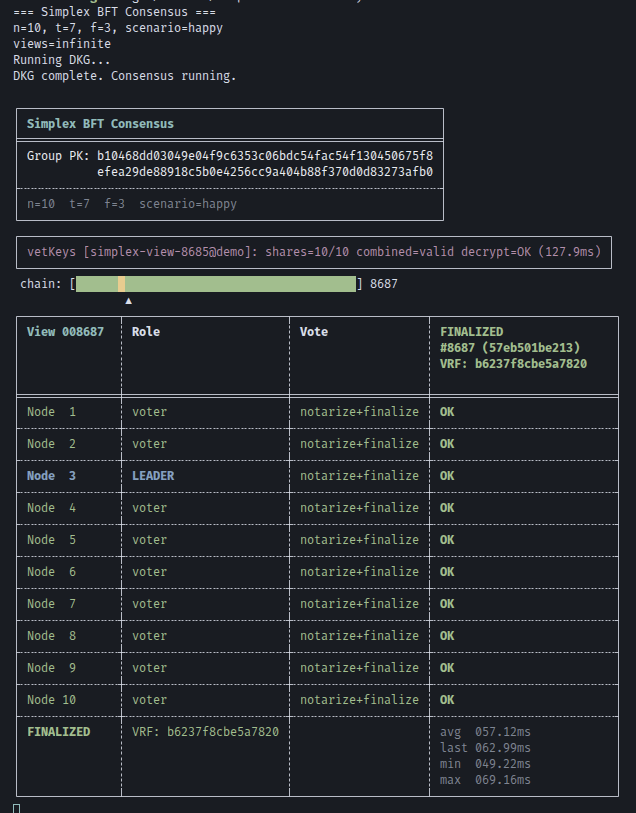

# golden-rs

Rust workspace for **threshold cryptography**, **BFT consensus**, and **identity-based encryption**.

| Component | Formal Verification Status |
|-----------|---------------------------|
| Golden DKG (Shamir, VSS, eVRF, Refresh, Reshare) | **Verified** -- 37 Lean theorems, 18 F* modules, 20 Kani harnesses |
| Threshold BLS signatures | Pending |
| Simplex BFT consensus | Pending |
| vetKeys IBE | Pending |



## Workspace

| Crate | Version | Description |
|-------|---------|-------------|
| [`golden-dkg`](golden-dkg/) | 0.1.1 | Golden non-interactive DKG protocol (Bunz, Choi, Komlo 2025) |
| [`golden-threshold-crypto`](threshold_crypto/) | 0.2.5 | BLS12-381 threshold signatures, vetKeys IBE, drand beacon |
| [`simplex-consensus`](simplex-consensus/) | 0.2.5 | Simplex BFT consensus with vetKeys demo (Chan & Pass 2023) |
| [`golden-demo`](golden-demo/) | -- | DKG network simulation demo |

## What's Here

### Golden DKG
One-round non-interactive distributed key generation using an exponent VRF (eVRF) built on Diffie-Hellman. No ElGamal, Paillier, or class-group encryption. Includes refresh (proactive share rotation) and reshare (membership change).

### Threshold BLS Signatures
BLS12-381 threshold signing with drand-compatible beacon format. Partial signing, Lagrange combination, pairing-based verification, and precomputed coefficient caches for fast multi-round signing.

### vetKeys Identity-Based Encryption
Boneh-Franklin IBE with verifiably encrypted threshold key derivation, following the [vetKeys paper](https://eprint.iacr.org/2023/616) (ePrint 2023/616). Encrypt to any identity string using only the group public key. Decryption keys are threshold-derived and privately delivered via transport encryption. Pairing-verifiable encrypted key shares. Fujisaki-Okamoto CCA transform.

### Simplex BFT Consensus
Pure state machine implementation of the [Simplex consensus protocol](https://eprint.iacr.org/2023/463) (Chan & Pass 2023). Message-passing simulation engine with Byzantine fault scenarios including silent leader, equivocation, fake leader, non-voter, full attack, and capitulation (f+1 Byzantine demonstrating BFT threshold violation). Integrated vetKeys IBE demo every N views.

## Quick Start

```bash
# Build everything
cargo build --workspace

# Run tests (51 tests)
cargo test --workspace

# Simplex consensus demo with vetKeys IBE every 5 views
cargo run --release --bin simplex-demo -- --vetkey-interval 5

# Simplex with Byzantine capitulation (f+1 attackers -- chain halts)
cargo run --release --bin simplex-demo -- -b capitulation --vetkey-interval 10

# Standalone vetKeys IBE demo
cargo run --example vetkeys_demo

# DKG network simulation
cargo run -p golden-demo
```

## Formal Verification

Multi-layered machine-checked verification. Single command: `make verify`

| Layer | Tool | What | Status |
|-------|------|------|--------|
| Paper math | Lean 4 + Mathlib | 37 theorems (Shamir, VSS, eVRF, Refresh, Reshare, UC) | Complete |
| Spec bridge | F* | 20 lemmas mirroring Lean theorems against extracted Rust | Phase 1 complete |
| Code extraction | hax + F* | 18 modules extracted, 3 post-extraction patches auto-applied | 18/18 PASS |
| Panic-freedom | Kani | 20 proof harnesses covering all modules | All verified |
| Functional tests | cargo test | 51 tests including adversarial scenarios | All pass |

```
Lean 4 (paper math)  <-->  F* specs  <-->  F* extraction  <-->  Rust code
     37 theorems          20 lemmas       18/18 modules        51 tests
```

See [`formal_verification/README.md`](formal_verification/README.md) for the full verification chain diagram.

## Security

### DKG (Golden paper)
- Schnorr PoK on PKI registration (Appendix F) -- prevents rogue-key attacks
- ark-spartan NIZK for eVRF proofs (Section 3.4)
- RFC 9380 hash-to-curve (BLS12-381 G1)
- Session IDs for replay protection
- SecretScalar zeroization on drop

### vetKeys (ePrint 2023/616)
- **Theorem 6** (co-CDH): valid encrypted key requires >= 1 honest node
- **Theorem 7** (co-BDH): IBE ciphertexts are semantically secure
- **Theorem 11**: safe single-key composition for IBE + signatures + VRF simultaneously
- Transport secret key zeroed on drop (NCC audit Finding XPJ)

### Simplex Consensus (ePrint 2023/463)
- **Lemma 3.2**: two distinct non-dummy blocks cannot both be notarized (f < n/3)
- **Lemma 3.3**: finalized height cannot have notarized dummy block
- **Theorem 3.1**: consistency -- honest finalized chains are prefixes of each other

## Architecture

```
golden-dkg/                  Pure DKG crypto library (published on crates.io)
threshold_crypto/            Threshold BLS + vetKeys IBE + beacon
  src/ibe.rs                 vetKeys IBE (Boneh-Franklin + transport encryption)
  src/signing.rs             Threshold BLS signing and verification
  src/beacon.rs              drand-compatible random beacon
  papers/                    vetKeys paper, NCC audit, DFINITY reference

simplex-consensus/           Simplex BFT consensus
  src/replica.rs             Pure state machine (formal verification target)
  src/types.rs               Protocol data structures
  src/vrf.rs                 Leader election oracle
  src/sim/engine.rs          Message-routing simulation engine
  src/sim/engine_vetkeys.rs  vetKeys IBE demo flow
  src/sim/naughty.rs         Byzantine behavior presets
  src/bin/main.rs            Terminal demo binary
  papers/                    Simplex + DispersedSimplex papers

formal_verification/         Unified formal verification
  lean/GoldenDkg/            Lean 4 proofs (37 theorems)
  proofs/fstar/golden-dkg/   F* extraction + specs
  proofs/fstar/models/       Shared arkworks type stubs
  proofs/fstar/patches/      Post-extraction patches (diff/patch)
  Makefile                   make verify
```

## References

- Bunz, Choi, Komlo. [Golden: Lightweight Non-Interactive DKG](https://eprint.iacr.org/2025/1924). IACR 2025/1924.
- Cerulli, Connolly, Neven, Preiss, Shoup. [vetKeys: How a Blockchain Can Keep Many Secrets](https://eprint.iacr.org/2023/616). ePrint 2023/616.
- Chan, Pass. [Simplex Consensus: A Simple and Fast Consensus Protocol](https://eprint.iacr.org/2023/463). ePrint 2023/463.
- Shoup. [DispersedSimplex](https://eprint.iacr.org/2023/1916). ePrint 2023/1916.
- [NCC Group VetKeys Audit](https://www.nccgroup.com/media/251hh3kn/ncc_group_dfinityusaresearch_vetkeys_report_2025-10-08_v10.pdf). October 2025.
- [DFINITY vetKeys Documentation](https://docs.internetcomputer.org/building-apps/network-features/vetkeys/introduction).

## License

MIT OR Apache-2.0
