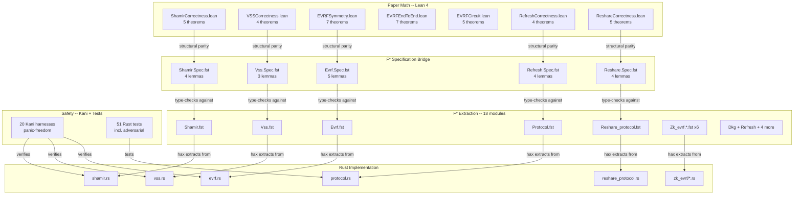

# Formal Verification of Golden DKG

Machine-checked proofs of correctness and security for the Golden non-interactive Distributed Key Generation protocol and its Rust implementation.

## Verification Chain



### How the Chain Works

1. **Lean 4** proves the paper's math is correct (37 theorems, 0 sorry in core files)
2. **F* Specs** state the same properties but applied to the extracted Rust code (20 lemmas)
3. **hax** automatically extracts Rust into F* (18 modules, all lax-check PASS)
4. **Kani** proves the Rust code never panics (20 harnesses)
5. **Tests** verify functional correctness empirically (51 tests incl. adversarial)

If someone changes the Rust code:
- hax re-extraction changes the F* code
- F* spec lemmas fail if the function signatures or behavior changed
- Kani harnesses catch new panic paths
- Rust tests catch functional regressions

## Running Verification After Code Changes

After modifying Rust code in `golden-dkg/`, run the full verification suite:

### Quick Check (2 minutes)

```bash
# 1. Rust tests -- catches functional regressions
cargo test --workspace

# 2. Lean proofs -- catches math spec regressions
cd formal_verification && lake build
```

### Full Verification (5-10 minutes)

```bash
# 1. Rust tests
cargo test --workspace

# 2. Lean 4 proofs (requires elan + Lean 4 toolchain)
cd formal_verification && lake build

# 3. Re-extract Rust to F* via hax (requires hax + nightly-2025-11-08)
cd golden-dkg
eval $(opam env --switch=hax-engine)
RUSTC_WRAPPER= cargo +nightly-2025-11-08 hax into fstar

# 4. Copy updated extraction files
cp golden-dkg/proofs/fstar/extraction/Golden_dkg.*.fst proofs/fstar/extraction/

# 5. F* lax-check all 18 extracted modules
FSTAR=~/.local/fstar/fstar/bin/fstar.exe
for f in proofs/fstar/extraction/Golden_dkg.*.fst; do
  $FSTAR --lax --warn_error -331 \
    --include proofs/fstar/models \
    --include proofs/fstar/extraction \
    --include proofs/fstar/specs \
    --include proofs/fstar/hax-libs/core \
    --include proofs/fstar/hax-libs/rust_primitives \
    --include proofs/fstar/hax-libs/hax_lib \
    "$f" || echo "FAIL: $f"
done

# 6. F* spec lemmas (type-check specs against extraction)
for f in proofs/fstar/specs/Golden_dkg.*.fst proofs/fstar/specs/Fold.Axioms.fst; do
  $FSTAR --lax --warn_error -331 \
    --include proofs/fstar/models \
    --include proofs/fstar/extraction \
    --include proofs/fstar/specs \
    --include proofs/fstar/hax-libs/core \
    --include proofs/fstar/hax-libs/rust_primitives \
    --include proofs/fstar/hax-libs/hax_lib \
    "$f" || echo "FAIL: $f"
done
```

### What Each Step Catches

| Step | Time | What It Catches |
|------|------|-----------------|
| `cargo test` | 15s | Logic bugs, adversarial attack handling, serialization errors |
| `lake build` | 30s | Math spec regressions (any change to Lean proof files) |
| hax re-extraction | 7s | Generates new F* from changed Rust (automatic) |
| F* lax-check (18 modules) | 3min | Type errors in extraction (changed function signatures, new dependencies) |
| F* spec check (6 files) | 40s | Spec-extraction mismatch (function API changed, types don't align) |

### Tool Installation

| Tool | Version | Install |
|------|---------|---------|
| Lean 4 | v4.27.0 | `curl -sSf https://raw.githubusercontent.com/leanprover/elan/master/elan-init.sh \| sh` |
| F* | v2025.10.06 | Download from [FStar releases](https://github.com/FStarLang/FStar/releases/tag/v2025.10.06) |
| hax | v0.3.6 | See [Implementation.md](Implementation.md) for build-from-source instructions |
| Kani | latest | `cargo install --locked kani-verifier && cargo kani setup` |

### Kani (Optional -- Slower)

```bash
# Run all 20 Kani harnesses (requires kani-verifier installed)
# Note: Kani cannot handle arkworks internals, so harnesses use
# simplified models. ~7 seconds total.
cd golden-dkg && cargo kani
```

## What This Is

Golden (Bunz, Choi, Komlo -- IACR 2025/1924) is a one-round DKG protocol achieving public verifiability via a novel exponent Verifiable Random Function (eVRF). This directory contains the formal verification effort: proving that the mathematical claims in the paper are correct, the Rust implementation faithfully realizes the paper's algorithms, and the ZK proof circuit correctly encodes the eVRF relation.

## Current Status

| Layer | Tool | Status |
|-------|------|--------|
| Paper math | Lean 4 | 37 theorems across 7 files (0 sorry in core) |
| F* spec bridge | F* | 20 lemmas across 5 spec files (Phase 1: admits) |
| Rust extraction | hax + F* | 18/18 modules pass lax-checking |
| Panic-freedom | Kani | 20 harnesses, all verified |
| Functional tests | cargo test | 51 tests pass |

## Three Verification Layers

### Layer 1: Mathematical Security Proofs (Lean 4 + VCV-io)

Machine-check the paper's security theorems:
- Shamir secret sharing correctness (polynomial interpolation)
- Feldman VSS binding (under DL hardness)
- eVRF DH symmetry and full pipeline correctness
- eVRF circuit completeness and constraint count
- Key refresh preserves secret, rotates shares
- Reshare preserves secret across group changes
- eVRF security game hops (scaffolded, 2 sorry)
- UC simulation (scaffolded, 2 sorry)

### Layer 2: Implementation Correctness (hax + F*)

Prove the Rust code matches the paper:
- hax extracts all 18 golden-dkg modules to F* (18/18 lax-check PASS)
- F* spec lemmas mirror each Lean theorem against the extracted code
- Shamir: reconstruction correctness, valid evaluation points, Horner's method
- VSS: completeness (honest shares verify), commitment binding
- eVRF: pad symmetry, encrypt/decrypt roundtrip, determinism, full pipeline
- Refresh: zero-sharing vanishes, secret preserved, PK unchanged
- Reshare: Lagrange aggregation, PK preservation, dealer binding

### Layer 3: Safety (Kani + Tests)

Prove the Rust code doesn't crash:
- 20 Kani harnesses: panic-freedom across shamir, vss, adapter, protocol, evrf, zk_evrf
- 51 Rust tests including 10 adversarial scenarios (tampered ciphertexts, wrong commitments, splitting attacks)

## Tools

| Tool | Purpose | Targets |
|------|---------|---------|
| **Lean 4 + Mathlib** | Algebraic properties (polynomials, EC group law, fields) | Shamir, VSS, circuit semantics |
| **VCV-io** | Game-based cryptography proofs (oracle model, reductions) | Schnorr PoK, eVRF security, DDH |
| **SSProve** | UC-style modular proofs in Coq | UC simulation (Theorem 3) |
| **hax** | Rust-to-F* extraction for implementation proofs | shamir.rs, vss.rs, evrf.rs |
| **Kani** | Bounded model checking for Rust safety | Panic-freedom, adapter correctness |

## Status

See [Implementation.md](Implementation.md) for the full task table and current status.

## Novel Contributions

This effort targets four results that would be firsts in the formal verification literature:

1. **First machine-checked UC security proof of any DKG protocol**
2. **First formal verification of a Bulletproofs/Spartan R1CS reduction**
3. **First Lean 4 formalization of the Leftover Hash Lemma for eVRF**
4. **First hax extraction and verification of arkworks-based cryptographic code**

## References

- [Golden paper](https://eprint.iacr.org/2025/1924) -- Bunz, Choi, Komlo. IACR 2025/1924.
- [VCV-io](https://github.com/dtumad/VCV-io) -- Formalized cryptography proofs in Lean 4.
- [SSProve](https://eprint.iacr.org/2021/397) -- Modular cryptographic proofs in Coq.
- [hax](https://hax.cryspen.com/) -- Rust formal verification toolchain.
- [Kani](https://model-checking.github.io/kani/) -- Rust bounded model checker.
- [Mathlib EC](https://leanprover-community.github.io/mathlib4_docs/Mathlib/AlgebraicGeometry/EllipticCurve/Weierstrass.html) -- Formal elliptic curve group law.
