# Formal Verification of Golden DKG

Machine-checked proofs of correctness and security for the Golden non-interactive Distributed Key Generation protocol and its Rust implementation.

## Verification Chain

```mermaid
flowchart TB
    subgraph paper [Paper Math -- Lean 4 -- 38 theorems]
        direction TB
        SHAMIR["ShamirCorrectness.lean\n5 theorems"]
        VSS_L["VSSCorrectness.lean\n3 theorems"]
        EVRF_SYM["EVRFSymmetry.lean\n6 theorems"]
        EVRF_E2E["EVRFEndToEnd.lean\n7 theorems"]
        EVRF_CIR["EVRFCircuit.lean\n4 theorems"]
        EVRF_SEC["EVRFSecurity.lean\n3 theorems"]
        REFRESH_L["RefreshCorrectness.lean\n4 theorems"]
        RESHARE_L["ReshareCorrectness.lean\n5 theorems"]
        UC_L["UCSimulation.lean\n1 proved + 1 sorry"]
    end

    subgraph specs [F* Specification Bridge -- all proved]
        direction TB
        SH_SPEC["Shamir.Spec.fst\n35+ lemmas"]
        VSS_SPEC["Vss.Spec.fst\n3 lemmas"]
        EVRF_SPEC["Evrf.Spec.fst\n5 lemmas"]
        REFRESH_SPEC["Refresh.Spec.fst\n4 lemmas"]
        RESHARE_SPEC["Reshare.Spec.fst\n4 lemmas"]
    end

    subgraph extraction [F* Extraction -- 18 modules]
        direction TB
        SH_EXT["Shamir.fst"]
        VSS_EXT["Vss.fst"]
        EVRF_EXT["Evrf.fst"]
        PROTO_EXT["Protocol.fst"]
        RESHARE_EXT["Reshare_protocol.fst"]
        ZK_EXT["Zk_evrf.*.fst x6"]
        OTHER_EXT["Dkg + Refresh + 4 more"]
    end

    subgraph rust [Rust Implementation]
        direction TB
        SHAMIR_RS["shamir.rs"]
        VSS_RS["vss.rs"]
        EVRF_RS["evrf.rs"]
        PROTO_RS["protocol.rs"]
        RESHARE_RS["reshare_protocol.rs"]
        ZK_RS["zk_evrf/*.rs"]
    end

    subgraph safety [Safety -- Kani + Tests]
        direction TB
        KANI["20 Kani harnesses\npanic-freedom"]
        TESTS["53 Rust tests\nincl. adversarial"]
    end

    SHAMIR -->|"structural parity"| SH_SPEC
    VSS_L -->|"structural parity"| VSS_SPEC
    EVRF_SYM -->|"structural parity"| EVRF_SPEC
    REFRESH_L -->|"structural parity"| REFRESH_SPEC
    RESHARE_L -->|"structural parity"| RESHARE_SPEC

    SH_SPEC -->|"type-checks against"| SH_EXT
    VSS_SPEC -->|"type-checks against"| VSS_EXT
    EVRF_SPEC -->|"type-checks against"| EVRF_EXT
    REFRESH_SPEC -->|"type-checks against"| PROTO_EXT
    RESHARE_SPEC -->|"type-checks against"| RESHARE_EXT

    SH_EXT -->|"hax extracts from"| SHAMIR_RS
    VSS_EXT -->|"hax extracts from"| VSS_RS
    EVRF_EXT -->|"hax extracts from"| EVRF_RS
    PROTO_EXT -->|"hax extracts from"| PROTO_RS
    RESHARE_EXT -->|"hax extracts from"| RESHARE_RS
    ZK_EXT -->|"hax extracts from"| ZK_RS

    KANI -->|"verifies"| SHAMIR_RS
    KANI -->|"verifies"| VSS_RS
    KANI -->|"verifies"| EVRF_RS
    TESTS -->|"tests"| PROTO_RS
```



### How the Chain Works

1. **Lean 4** proves the paper's math is correct (38 theorems, 1 sorry -- UC composition only)
2. **F* Specs** state the same properties applied to the extracted Rust code and prove them (1 axiom remaining -- DL hardness)
3. **hax** automatically extracts Rust into F* (18 modules, 0 warnings, all lax-check PASS)
4. **Kani** proves the Rust code never panics (20 harnesses)
5. **Tests** verify functional correctness empirically (53 tests incl. adversarial)

If someone changes the Rust code:
- hax re-extraction changes the F* code
- F* spec lemmas fail if the function signatures or behavior changed
- Kani harnesses catch new panic paths
- Rust tests catch functional regressions

## Running Verification After Code Changes

After modifying Rust code in `golden-dkg/`, run the full verification suite:

### One-Command Full Verification (~15 minutes)

```bash
make verify
```

This runs all steps automatically with dependency tracking (only re-runs what changed):
1. `cargo test --workspace` (53 tests)
2. `lake build` (38 Lean theorems)
3. `cargo hax into fstar` (re-extract from current Rust)
4. F* lax-check (18 extraction modules + 6 spec files)

### Quick Check (~2 minutes)

```bash
make verify-quick
```

Runs cargo test + Lean only (skips hax/F*).

### Force Full Re-run

```bash
make -C formal_verification clean && make verify
```

Clears all cached stamps and re-runs everything from scratch.

### What Each Step Catches

| Step | Time | What It Catches |
|------|------|-----------------|
| `cargo test` | 15s | Logic bugs, adversarial attack handling, serialization errors |
| `lake build` | 30s | Math spec regressions (any change to Lean proof files) |
| hax re-extraction | 7s | Generates new F* from changed Rust (automatic) |
| F* lax-check (18 modules) | 3min | Type errors in extraction (changed function signatures, new dependencies) |
| F* spec check (6 files) | 40s | Spec-extraction mismatch (function API changed, types don't align) |

### Tool Installation

| Tool | Version | Install |
|------|---------|---------|
| Lean 4 | v4.27.0 | `curl -sSf https://raw.githubusercontent.com/leanprover/elan/master/elan-init.sh \| sh` |
| F* | v2025.10.06 | Download from [FStar releases](https://github.com/FStarLang/FStar/releases/tag/v2025.10.06) |
| hax | v0.3.6 | See [Implementation.md](Implementation.md) for build-from-source instructions |
| Kani | latest | `cargo install --locked kani-verifier && cargo kani setup` |

### Kani (Optional -- Slower)

```bash
# Run all 20 Kani harnesses (requires kani-verifier installed)
# Note: Kani cannot handle arkworks internals, so harnesses use
# simplified models. ~7 seconds total.
cd golden-dkg && cargo kani
```

## What This Is

Golden (Bunz, Choi, Komlo -- IACR 2025/1924) is a one-round DKG protocol achieving public verifiability via a novel exponent Verifiable Random Function (eVRF). This directory contains the formal verification effort: proving that the mathematical claims in the paper are correct, the Rust implementation faithfully realizes the paper's algorithms, and the ZK proof circuit correctly encodes the eVRF relation.

## Current Status

| Layer | Tool | Status |
|-------|------|--------|
| Paper math | Lean 4 | **38 theorems** across 9 files, **1 sorry** (UC composition -- research-level) |
| F* spec bridge | F* | All lemmas proved, **1 axiom** (DL hardness -- permanent) |
| Rust extraction | hax + F* | **18/18 modules**, **0 hax warnings**, all lax-check PASS |
| Panic-freedom | Kani | 20 harnesses, all verified |
| Functional tests | cargo test | **53 tests** pass, 0 warnings |

### Permanent Remaining Items

| Item                     | Location          | Why it remains                                                                                                                                                          |
| ------------------------ | ----------------- | ----------------------------------------------------------------------------------------------------------------------------------------------------------------------- |
| `reshare_dealer_binding` | Reshare.Spec.fst  | DL hardness assumption: "if g^a == g^b then a == b". Standard cryptographic axiom -- cannot be proved, only assumed.                                                    |
| `golden_uc_security`     | UCSimulation.lean | Full UC composition theorem: requires 8-12 weeks of probabilistic formalization. Statement is complete; algebraic core (simulator PK programming, LHL bound) is proved. |

## Three Verification Layers

### Layer 1: Mathematical Security Proofs (Lean 4 + Mathlib)

38 machine-checked theorems proving the paper's security claims:
- Shamir secret sharing: reconstruction correctness, interpolation uniqueness (5 theorems)
- Feldman VSS: completeness, commitment binding (3 theorems)
- eVRF DH symmetry: pad symmetry, encrypt/decrypt, commitment consistency (6 theorems)
- eVRF end-to-end: pipeline correctness, uniqueness, relation satisfaction (7 theorems)
- eVRF circuit: completeness, knowledge extraction, constraint count (4 theorems)
- Refresh: secret preservation, PK invariance, share rotation (4 theorems)
- Reshare: Lagrange aggregation, PK preservation, dealer binding, threshold validity (5 theorems)
- eVRF security: advantage triangle, LHL bound (proved), security composition (3 theorems)
- UC simulation: simulator PK programming (proved), UC security bound (1 sorry)

### Layer 2: Implementation Correctness (hax + F*)

Prove the Rust code matches the paper's algorithms:
- hax extracts all 18 golden-dkg modules to F* (0 warnings, 18/18 lax-check PASS)
- Non-crypto code (serialization, memory zeroization) excluded via `#[hax_lib::exclude]`
- Rust loops rewritten from `iter().enumerate()` to index-based `for i in 0..n` so hax generates transparent `fold_range` (not opaque `fold_enumerated_slice`)
- Recursive Lagrange spec functions bridge the extracted fold_range to mathematical definitions

Proved spec lemmas (all closed, 0 admits except DL axiom):
- **Shamir**: reconstruction correctness (via parallel recursion + bridge axioms), polynomial evaluation, generate/interpolate roundtrip, (2,2) and (3,3) concrete algebraic proofs
- **VSS**: ciphertext check identity (EC distributivity), share completeness, commitment correctness
- **eVRF**: DH shared secret symmetry, derive_pad symmetry (full function unfolding through into_affine + extract_x + hash_to_curve chain), encrypt/decrypt roundtrip, pipeline correctness
- **Refresh**: secret preservation (field distributivity), PK invariance (smul_zero), share rotation, zero-sharing vanishes
- **Reshare**: Lagrange aggregation (double interpolation), PK preservation, threshold validity

### Layer 3: Safety (Kani + Tests)

Prove the Rust code doesn't crash:
- 20 Kani harnesses: panic-freedom across shamir, vss, adapter, protocol, evrf, zk_evrf, refresh, reshare, schnorr
- 53 Rust tests including adversarial scenarios (tampered ciphertexts, wrong commitments, splitting attacks)
- 0 compiler warnings across entire workspace

## Tools

| Tool | Purpose | Targets |
|------|---------|---------|
| **Lean 4 + Mathlib** | Algebraic properties (polynomials, EC group law, fields) | Shamir, VSS, circuit semantics |
| **VCV-io** | Game-based cryptography proofs (oracle model, reductions) | Schnorr PoK, eVRF security, DDH |
| **SSProve** | UC-style modular proofs in Coq | UC simulation (Theorem 3) |
| **hax** | Rust-to-F* extraction for implementation proofs | shamir.rs, vss.rs, evrf.rs |
| **Kani** | Bounded model checking for Rust safety | Panic-freedom, adapter correctness |

## Status

See [Implementation.md](Implementation.md) for the full task table and current status.

## Novel Contributions

This effort targets four results that would be firsts in the formal verification literature:

1. **First machine-checked UC security proof of any DKG protocol**
2. **First formal verification of a Bulletproofs/Spartan R1CS reduction**
3. **First Lean 4 formalization of the Leftover Hash Lemma for eVRF**
4. **First hax extraction and verification of arkworks-based cryptographic code**

## References

- [Golden paper](https://eprint.iacr.org/2025/1924) -- Bunz, Choi, Komlo. IACR 2025/1924.
- [VCV-io](https://github.com/dtumad/VCV-io) -- Formalized cryptography proofs in Lean 4.
- [SSProve](https://eprint.iacr.org/2021/397) -- Modular cryptographic proofs in Coq.
- [hax](https://hax.cryspen.com/) -- Rust formal verification toolchain.
- [Kani](https://model-checking.github.io/kani/) -- Rust bounded model checker.
- [Mathlib EC](https://leanprover-community.github.io/mathlib4_docs/Mathlib/AlgebraicGeometry/EllipticCurve/Weierstrass.html) -- Formal elliptic curve group law.
